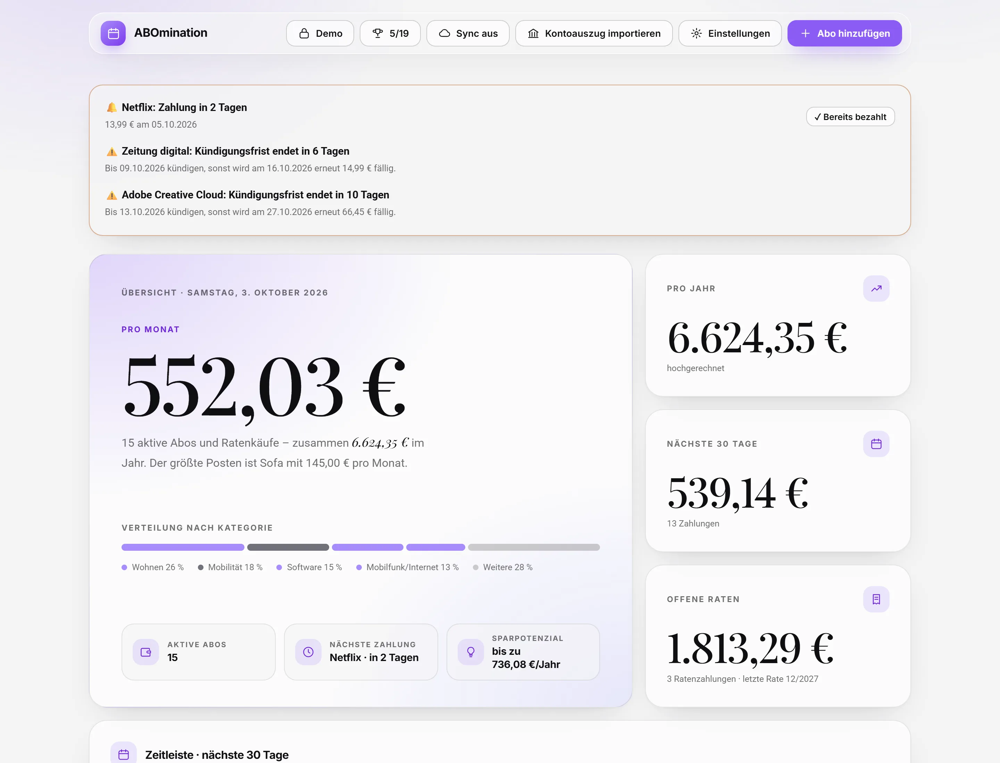
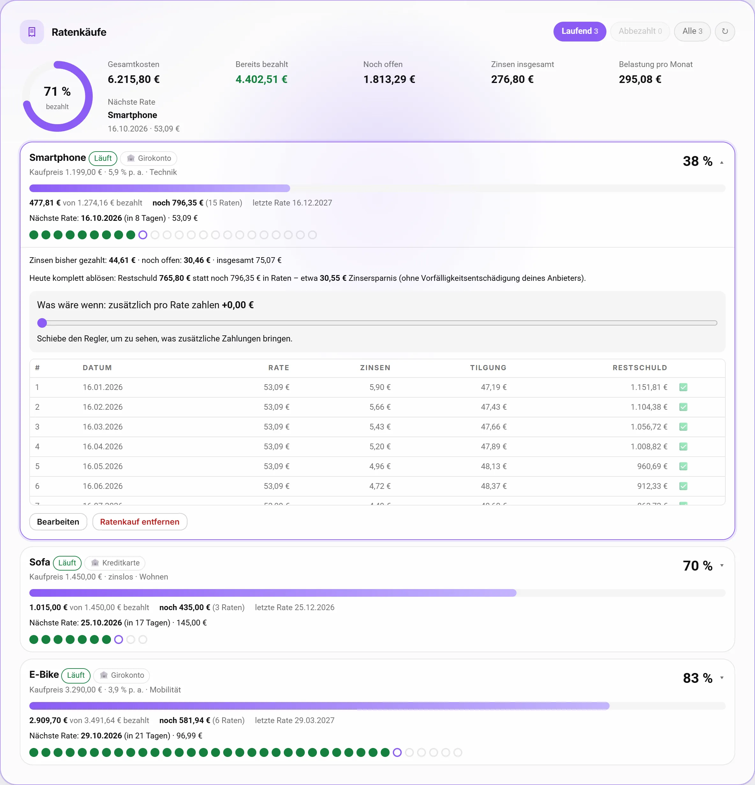
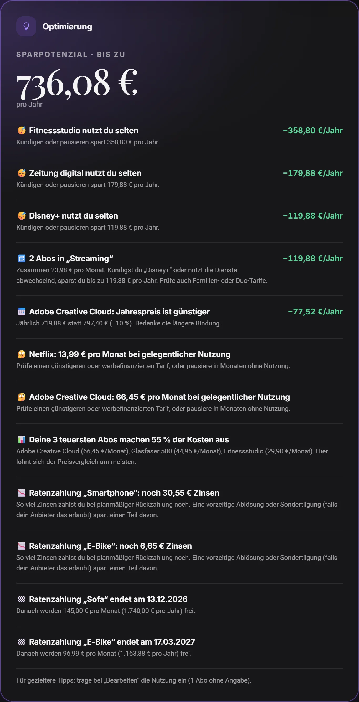
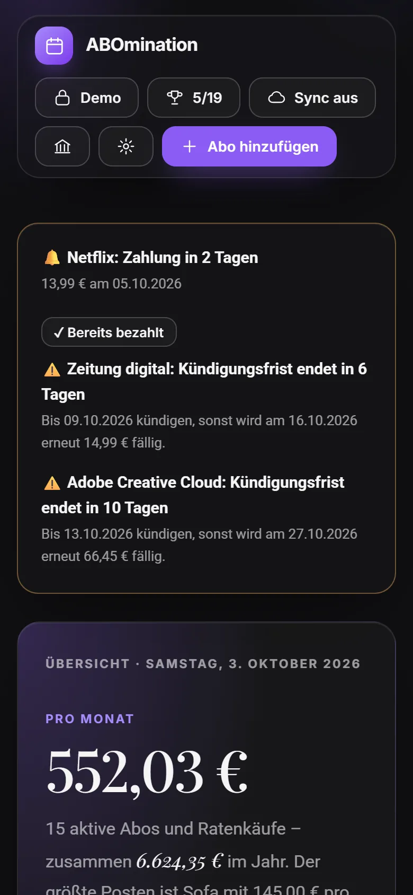
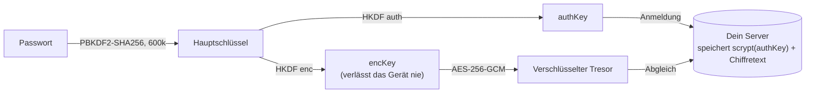
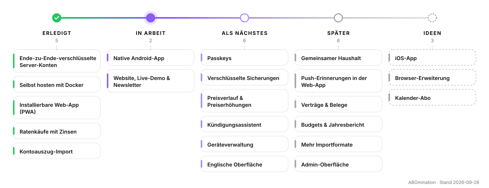

<p align="center">
  
</p>

<h1 align="center">ABOmination</h1>

<p align="center">
  <b>Jedes Abo. Jede Rate. Ein ruhiger Überblick.</b><br>
  Abos und Ratenzahlungen im Blick – mit Erinnerungen, Kündigungsfristen, Zinsberechnung und Spartipps.<br>
  Ende-zu-Ende-verschlüsselt auf deinem Gerät, lokal oder auf deinem eigenen Server.
</p>

<p align="center">
  <a href="https://github.com/riv3ty/ABOmination/actions/workflows/ci.yml"></a>
  <a href="https://github.com/riv3ty/ABOmination/pkgs/container/abomination"></a>
  <a href="https://riv3ty.github.io/ABOmination/"></a>
  <a href="LICENSE"></a>
</p>

<p align="center">
  <a href="https://riv3ty.github.io/ABOmination/"><b>Website</b></a> ·
  <a href="https://riv3ty.github.io/ABOmination/app/?demo"><b>Live-Demo</b></a> ·
  <a href="DEPLOYMENT.de.md">Selbst hosten</a> ·
  <a href="ROADMAP.de.md">Roadmap</a> ·
  <a href="README.md">English</a>
</p>

<p align="center">
  <picture>
    <source media="(prefers-color-scheme: dark)" srcset="docs/screenshots/dashboard-dark.webp">
    
  </picture>
</p>

## Das kann ABOmination

- **Ehrliches Dashboard** – Monats- und Jahressumme, die nächsten 30 Tage als Zeitleiste, Kosten nach Kategorie und Bankkonto, mehrere Währungen mit EZB-Kursen.
- **Ratenkäufe richtig gerechnet** – Tilgungsplan, gezahlte und offene Zinsen, Restschuld und ein Simulator für Sondertilgungen.
- **Keine Frist verpassen** – Hinweise vor Zahlungen und Kündigungsfristen, Kalender-Export (`.ics`) für Outlook, Google und Apple.
- **Kontoauszug-Import** – wiederkehrende Zahlungen werden in CSV-Exporten automatisch erkannt.
- **Spartipps** – selten genutzte, doppelte oder überlappende Abos und günstigere Jahrestarife.
- **Datenschutz eingebaut** – AES-256-GCM-Verschlüsselung im Browser, kein Tracking, keine Anfragen an Dritte.
- **Läuft überall** – eine einzige HTML-Datei, eigener Docker-Server mit Konten und Abgleich, installierbare App (PWA), auch offline. Eine native Android-App ist in Arbeit.

<table>
  <tr>
    <td width="58%"></td>
    <td width="30%"></td>
    <td width="12%"></td>
  </tr>
</table>

## So werden deine Daten geschützt



Der Server sieht weder dein Passwort noch deine Daten – ein Datenbank-Leck verrät nichts Lesbares. Deshalb gibt es **keinen Passwort-Reset**. Details: [server/API.de.md](server/API.de.md) · Sicherheitslücken melden: [SECURITY.de.md](SECURITY.de.md).

## Loslegen

### 1. Im Browser ausprobieren
Die **[Live-Demo](https://riv3ty.github.io/ABOmination/app/?demo)** läuft komplett in deinem Browser mit Beispieldaten – nichts wird hochgeladen.

### 2. Selbst hosten mit Docker
Konten für deinen Haushalt, Abgleich zwischen Geräten, hinter deinem vorhandenen Reverse Proxy (HTTPS nötig):

```bash
mkdir abomination && cd abomination
curl -fsSLO https://raw.githubusercontent.com/riv3ty/ABOmination/main/compose.yaml
docker compose pull && docker compose up -d
docker compose exec app abo invite --note "ich"   # Einladungscode für das erste Konto
```

Reverse-Proxy-Beispiele (nginx, Caddy, Traefik, Nginx Proxy Manager), Backups und Updates: **[DEPLOYMENT.de.md](DEPLOYMENT.de.md)**.

### 3. Nur lokal
Einmal bauen und `dist/index.html` öffnen – kein Server nötig. Die Daten bleiben verschlüsselt im Browser; optionaler Abgleich über einen Cloud-Ordner, Nextcloud, Google Drive oder OneNote ([SYNC.de.md](SYNC.de.md)). Unter Windows startet `Abo-Manager-starten.cmd` die App auf http://localhost:8765.

```bash
npm ci && npm run build
```

## Technik

| Teil | Technologie |
|---|---|
| Web-App | Vanilla JavaScript (ES-Module), Vite, gebaut als eine einzige HTML-Datei |
| Kryptografie | WebCrypto: PBKDF2, HKDF, AES-256-GCM |
| Server | Node.js 24, Fastify 5, eingebautes `node:sqlite`, keine nativen Module |
| Betrieb | Docker (ohne Root, schreibgeschützt), GitHub Container Registry |
| Qualität | Vitest (Unit + API), ESLint, Puppeteer-Ende-zu-Ende-Test mit zwei Browsern, CI bei jedem Push |

## Entwicklung

```bash
npm ci
npm run dev          # Web-App auf http://localhost:8765 (leitet /api an :8080 weiter)
npm run server:dev   # API-Server auf :8080
npm run check        # Lint + Tests + Build
npm run e2e          # echter Server + zwei Chrome-Instanzen
```

Alle Befehle und die Projektstruktur: [docs/DEVELOPMENT.de.md](docs/DEVELOPMENT.de.md).

## Roadmap

<picture>
  <source media="(prefers-color-scheme: dark)" srcset="docs/roadmap/roadmap-de-dark.svg">
  
</picture>

Als Nächstes: native Android-App, Passkeys, verschlüsselte Sicherungen, Hinweise bei Preiserhöhungen und ein Kündigungsassistent. Details in **[ROADMAP.de.md](ROADMAP.de.md)** – Neuigkeiten gibt es auch per Newsletter auf der [Website](https://riv3ty.github.io/ABOmination/).

## Dokumentation

Alle Dokumente gibt es auf Deutsch und Englisch.

| Thema | Deutsch | English |
|---|---|---|
| Selbst hosten mit Docker | [DEPLOYMENT.de.md](DEPLOYMENT.de.md) | [DEPLOYMENT.md](DEPLOYMENT.md) |
| Cloud-Sync für lokale Profile | [SYNC.de.md](SYNC.de.md) | [SYNC.md](SYNC.md) |
| Server-API & Verschlüsselungsprotokoll | [server/API.de.md](server/API.de.md) | [server/API.md](server/API.md) |
| Entwicklung | [docs/DEVELOPMENT.de.md](docs/DEVELOPMENT.de.md) | [docs/DEVELOPMENT.md](docs/DEVELOPMENT.md) |
| Roadmap | [ROADMAP.de.md](ROADMAP.de.md) | [ROADMAP.md](ROADMAP.md) |
| Sicherheitsrichtlinie | [SECURITY.de.md](SECURITY.de.md) | [SECURITY.md](SECURITY.md) |
| Mitmachen | [CONTRIBUTING.de.md](CONTRIBUTING.de.md) | [CONTRIBUTING.md](CONTRIBUTING.md) |

<!-- support:start -->
## Unterstützen

ABOmination ist für die private Nutzung kostenlos, ohne Werbung und Tracking. Wenn es dir Geld spart, kannst du die Weiterentwicklung unterstützen:

<a href="https://github.com/sponsors/riv3ty"></a>
<a href="https://ko-fi.com/sudonoob"></a>
<a href="https://liberapay.com/sudo_noob/donate"></a>

- **[GitHub Sponsors](https://github.com/sponsors/riv3ty)** – monatlich oder einmalig
- **[Ko-fi](https://ko-fi.com/sudonoob)** – einen Kaffee ausgeben, ohne Konto
- **[Liberapay](https://liberapay.com/sudo_noob/donate)** – regelmäßig, gemeinnützige Plattform
<!-- support:end -->

## Mitmachen

Fehlerberichte und Ideen sind sehr willkommen – bitte über die [Issue-Vorlagen](https://github.com/riv3ty/ABOmination/issues/new/choose). Pull Requests nur nach vorheriger Absprache, siehe [CONTRIBUTING.de.md](CONTRIBUTING.de.md).

## Lizenz

© 2026 Maciej Peciak. **Kostenlos für die private, nicht-kommerzielle Nutzung** – auch selbst gehostet für dich und deinen Haushalt. Kommerzielle Nutzung und Weiterverbreitung nur mit Erlaubnis. Der Quellcode ist öffentlich, die Lizenz ist aber keine Open-Source-Lizenz – siehe [LICENSE](LICENSE). Die eingebetteten Schriften stehen unter der SIL Open Font License ([Details](web/src/fonts/LICENSE.md)).
