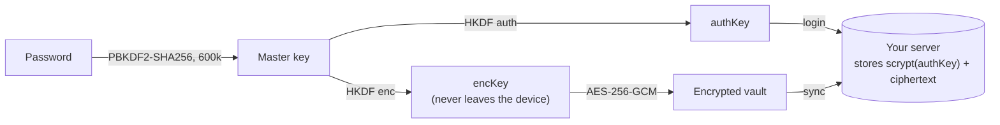
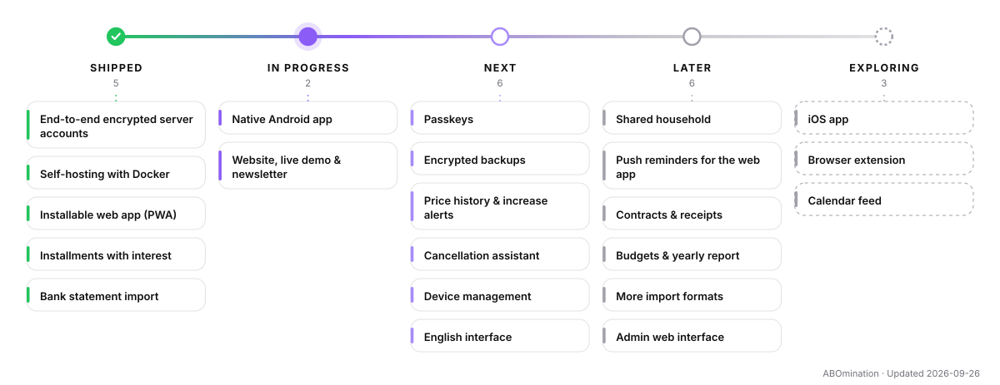

<p align="center">
  
</p>

<h1 align="center">ABOmination</h1>

<p align="center">
  <b>Every subscription. Every installment. One calm overview.</b><br>
  Track subscriptions and installment plans with reminders, cancellation deadlines, interest calculation and savings tips –<br>
  end-to-end encrypted on your device, usable locally or on your own server.
</p>

<p align="center">
  <a href="https://github.com/riv3ty/ABOmination/actions/workflows/ci.yml"></a>
  <a href="https://github.com/riv3ty/ABOmination/pkgs/container/abomination"></a>
  <a href="https://riv3ty.github.io/ABOmination/"></a>
  <a href="LICENSE"></a>
  
</p>

<p align="center">
  <a href="https://riv3ty.github.io/ABOmination/"><b>Website</b></a> ·
  <a href="https://riv3ty.github.io/ABOmination/app/?demo"><b>Live demo</b></a> ·
  <a href="DEPLOYMENT.md">Self-hosting</a> ·
  <a href="ROADMAP.md">Roadmap</a> ·
  <a href="README.de.md">Deutsch</a>
</p>

<p align="center">
  <picture>
    <source media="(prefers-color-scheme: dark)" srcset="docs/screenshots/dashboard-dark.webp">
    
  </picture>
</p>

## Highlights

- **Honest dashboard** – monthly and yearly totals, the next 30 days on a timeline, spending by category and bank account, multi-currency with ECB exchange rates.
- **Installments done right** – amortization schedule, interest paid and outstanding, remaining debt and an early-payoff simulator.
- **Salary & budget** – enter your gross salary (monthly or yearly) and get your net pay as in a German payslip: wage tax and solidarity surcharge from the official BMF program flowchart 2026 (to the cent), church tax and social security – plus what's left after subscriptions and installments.
- **Never miss a deadline** – reminders before payments and cancellation deadlines (mark a payment as *already paid* with one click), calendar export (`.ics`) for Outlook, Google and Apple.
- **Bank statement import** – recurring payments are detected automatically in CSV exports.
- **Savings tips** – rarely used, duplicated or overlapping subscriptions and cheaper yearly plans.
- **Privacy by design** – AES-256-GCM encryption in the browser, no tracking, no third-party requests.
- **Runs everywhere** – single HTML file, self-hosted Docker server with accounts and sync, installable PWA that works offline. A native Android app is in progress.

<table>
  <tr>
    <td width="58%"></td>
    <td width="30%"></td>
    <td width="12%"></td>
  </tr>
</table>

## How your data is protected



The server never sees your password or your data – a database leak reveals nothing readable. For that reason there is **no password reset**. Details: [server/API.md](server/API.md) · Reporting vulnerabilities: [SECURITY.md](SECURITY.md).

## Getting started

### 1. Try it in the browser
Open the **[live demo](https://riv3ty.github.io/ABOmination/app/?demo)** – it runs entirely in your browser with sample data; nothing is uploaded.

### 2. Self-host with Docker
Accounts for your household and sync across devices, behind your existing reverse proxy (HTTPS required):

```bash
mkdir abomination && cd abomination
curl -fsSLO https://raw.githubusercontent.com/riv3ty/ABOmination/main/compose.yaml
docker compose pull && docker compose up -d
docker compose exec app abo invite --note "me"   # invite code for the first account
```

Reverse proxy examples (nginx, Caddy, Traefik, Nginx Proxy Manager), backups and updates: **[DEPLOYMENT.md](DEPLOYMENT.md)**.

### 3. Local only
Build once and open `dist/index.html` – no server required. Data stays encrypted in your browser; optional sync via a cloud folder, Nextcloud, Google Drive or OneNote ([SYNC.md](SYNC.md)).

```bash
npm ci && npm run build
```

## Tech stack

| Part | Technology |
|---|---|
| Web app | Vanilla JavaScript (ES modules), Vite, built into a single HTML file |
| Crypto | WebCrypto: PBKDF2, HKDF, AES-256-GCM |
| Server | Node.js 24, Fastify 5, built-in `node:sqlite`, no native modules |
| Deployment | Docker (non-root, read-only), GitHub Container Registry |
| Quality | Vitest (unit + API), ESLint, Puppeteer end-to-end test with two browsers, CI on every push |

## Development

```bash
npm ci
npm run dev          # web app on http://localhost:8765 (proxies /api to :8080)
npm run server:dev   # API server on :8080
npm run check        # lint + tests + build
npm run e2e          # real server + two Chrome instances
```

All commands and the project layout: [docs/DEVELOPMENT.md](docs/DEVELOPMENT.md).

## Roadmap

<picture>
  <source media="(prefers-color-scheme: dark)" srcset="docs/roadmap/roadmap-en-dark.svg">
  
</picture>

Next up: native Android app, passkeys, encrypted backups, price-increase alerts and a cancellation assistant. Details in **[ROADMAP.md](ROADMAP.md)** – and follow updates via the newsletter on the [website](https://riv3ty.github.io/ABOmination/).

## Documentation

Every document is available in English and German.

| Topic | English | Deutsch |
|---|---|---|
| Self-hosting with Docker | [DEPLOYMENT.md](DEPLOYMENT.md) | [DEPLOYMENT.de.md](DEPLOYMENT.de.md) |
| Cloud sync for local profiles | [SYNC.md](SYNC.md) | [SYNC.de.md](SYNC.de.md) |
| Server API & encryption protocol | [server/API.md](server/API.md) | [server/API.de.md](server/API.de.md) |
| Development | [docs/DEVELOPMENT.md](docs/DEVELOPMENT.md) | [docs/DEVELOPMENT.de.md](docs/DEVELOPMENT.de.md) |
| Roadmap | [ROADMAP.md](ROADMAP.md) | [ROADMAP.de.md](ROADMAP.de.md) |
| Security policy | [SECURITY.md](SECURITY.md) | [SECURITY.de.md](SECURITY.de.md) |
| Contributing | [CONTRIBUTING.md](CONTRIBUTING.md) | [CONTRIBUTING.de.md](CONTRIBUTING.de.md) |

<!-- support:start -->
## Support

ABOmination is free for personal use, without ads or tracking. If it saves you money, you can support its development:

<a href="https://github.com/sponsors/riv3ty"></a>
<a href="https://ko-fi.com/sudonoob"></a>
<a href="https://liberapay.com/sudo_noob/donate"></a>

- **[GitHub Sponsors](https://github.com/sponsors/riv3ty)** – monthly or one-time
- **[Ko-fi](https://ko-fi.com/sudonoob)** – buy a coffee, no account needed
- **[Liberapay](https://liberapay.com/sudo_noob/donate)** – recurring, non-profit platform
<!-- support:end -->

## Contributing

Bug reports and ideas are very welcome – please use the [issue templates](https://github.com/riv3ty/ABOmination/issues/new/choose). Pull requests only after prior agreement, see [CONTRIBUTING.md](CONTRIBUTING.md).

## License

© 2026 Maciej Peciak. **Free for personal, non-commercial use** – including self-hosting for yourself and your household. Commercial use and redistribution require permission. The source code is public but this is not an open-source license – see [LICENSE](LICENSE). Bundled fonts are licensed under the SIL Open Font License ([details](web/src/fonts/LICENSE.md)).
